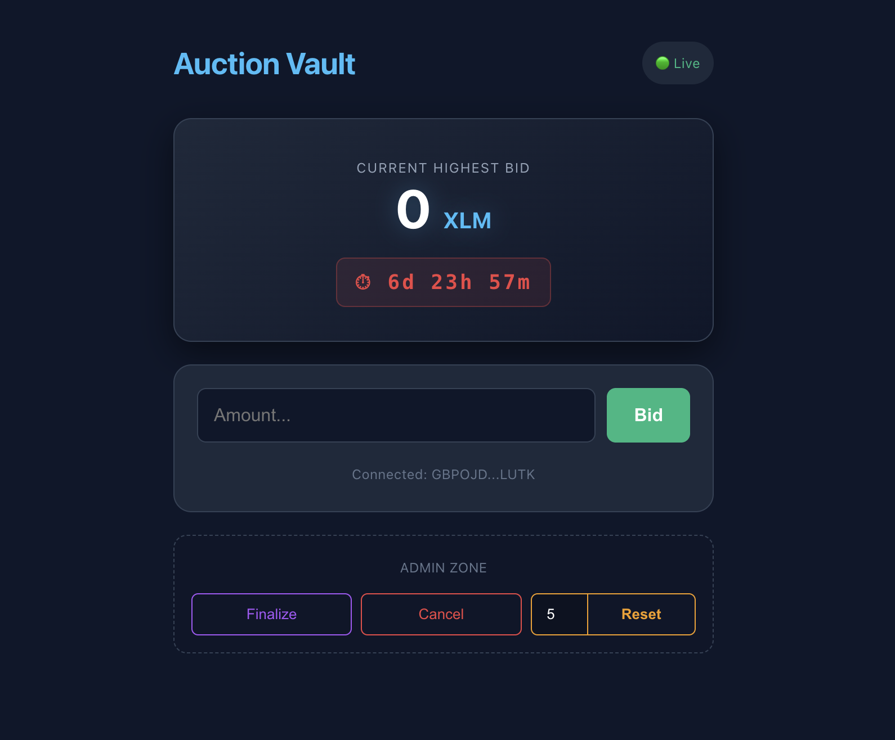

# No loss auction Vault

**contract_address**: [CCHWSSU5SXNTWAZKPMJRCRR6PCKFW5BIWKIXMBQXQY2YMOME4CVKWMF2](https://stellar.expert/explorer/testnet/contract/CCHWSSU5SXNTWAZKPMJRCRR6PCKFW5BIWKIXMBQXQY2YMOME4CVKWMF2)

**Live Demo**: https://felnoloss.vercel.app

No loss auction Vault is a decentralized, permissioned state-machine built on the Stellar network using Soroban. It facilitates secure, transparent token auctions with strict cryptographic authorization, automated countdowns, and guaranteed settlement.

- [No loss auction Vault](#no-loss-auction-vault)
  - [Core Features](#core-features)
  - [🛠️ Tech Stack](#️-tech-stack)
  - [The Auction Lifecycle (How it Works)](#the-auction-lifecycle-how-it-works)

## Core Features

- Permissionless Settlement: Once the auction clock hits zero, anyone can invoke the finalize function to trigger the distribution of assets.

- Cryptographic Authorization: Administrative functions (reset and cancel) strictly require the deployer's signature `(require_auth())`, ensuring malicious actors cannot wipe the board.

- Wasm VM Trap Protection: Engineered with safety guards that intentionally panic and reject transactions if a user attempts to interact with an expired or closed auction.

- Edge-to-Edge React UI: A responsive, full-bleed frontend built with Vite, seamlessly integrated with the Freighter wallet for real-time state fetching and transaction signing.

## 🛠️ Tech Stack

- **Smart Contract**: Rust / Soroban SDK

- **Frontend**: React / Vite / TypeScript

- **Wallet Integration**: `@stellar/freighter-api`

- **Network**: Stellar Testnet

## The Auction Lifecycle (How it Works)

The no loss auction Vault operates on a strict 4-step chronological loop to ensure on-chain transparency and the separation of settlement logic from state-clearing logic.

1. Initialization: The Admin deploys the Wasm contract and sets a custom future Unix timestamp (deadline).

2. The Bidding War: Users connect their Freighter wallets and submit bids. The smart contract automatically escrows the tokens and refunds previous out-bid users.

3. The Settlement (finalize): When the countdown hits 0m 0s, the auction freezes. Anyone can click Finalize to officially lock the state, distribute the prize to the highest bidder, and record the final numbers permanently on the ledger.

4. The Recycling (reset): Only the true Admin can click Reset. The contract verifies the previous auction is successfully closed, wipes the historical data back to zero, and accepts a new custom minute parameter to start a fresh countdown.

_built for the stellar ecosystem_
